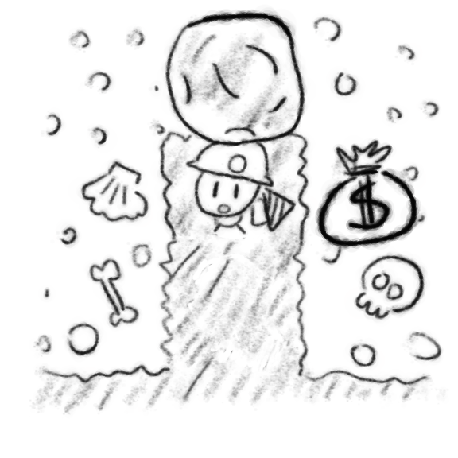

# Mine

## Rules

This is a simple digging and rock pushing game. The player controls a miner,
represented by a blinking pixel.

They can move up/down/left/right, digging a tunnel (represented with black
pixels). They can't dig through rocks (represented as red pixels), but they can
hold the rock if they stand below it, and they can push the rock left and right
if there is empty space on the other side.

Unsupported rocks fall down. The objective of the game is to collect all treasures, represented as yellow pixels.

If at any point a falling rock hits the miner, it stuns them, and the game is over.

If two rocks stand on top of each other, they can be held in place by dirt or the miner.

However, if there is empty space next to the rocks, the top rock will slip to the side and fall down.

## Code
